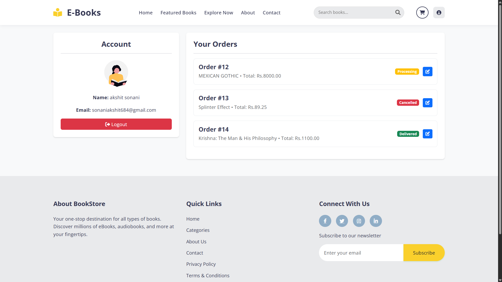
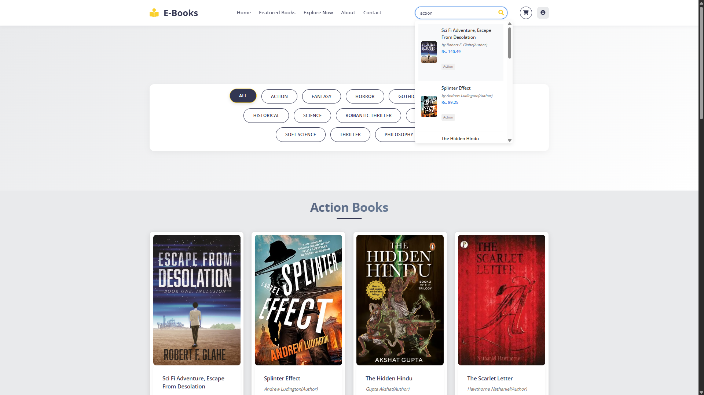
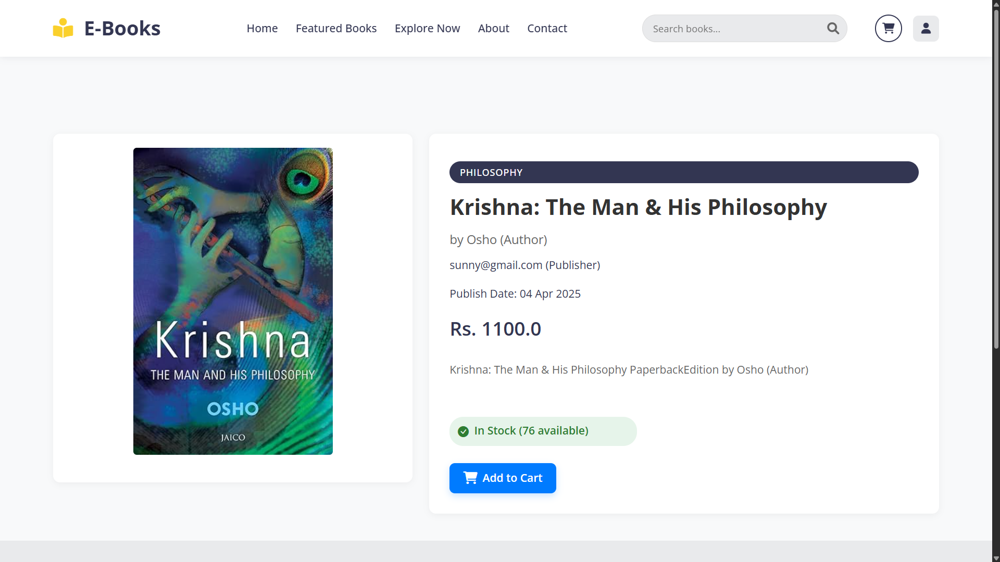
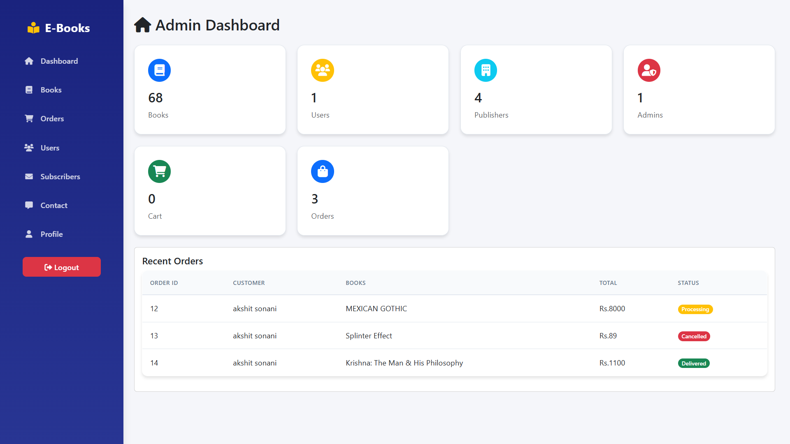
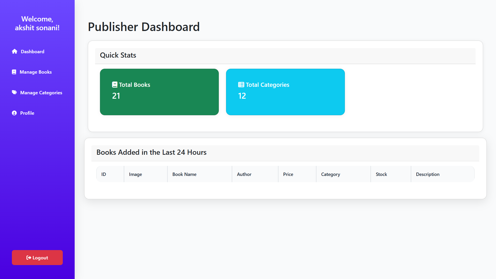

# 📚 BookStore Web Application

A fully functional and modern digital bookstore built using **Java Servlets**, **JSP**, and **MySQL**. This platform provides a seamless experience for customers, publishers, and administrators to manage, browse, and purchase e-books online.

## 🚀 Live Demo

> 🔗 *Coming Soon*

## 📸 Screenshots

### Home Page


### User Profile


### Book List


### Book Details


### Admin Dashboard


### Publisher Panel



# 🌟 Key Features

## 👤 **Customer**
- 🔍 Browse and search books by title, author, or category
- 🛒 Add to cart, update quantity, and remove items
- 📄 View book details with cover image, price, and author
- 🔐 User registration, login, and logout
- 📦 View order history and profile details

## 📝 **Publisher**
- 📚 Upload and manage books with images and metadata
- ✏️ Edit book details (price, description, category)
- 🗃️ Manage personal dashboard and sales stats
- 🗂️ Add and manage book categories

## 🛠️ **Admin**
- 👥 Manage users and publishers
- 📘 Full book and category control
- 📈 Monitor sales and analytics
- ✅ Approve or remove publishers
- ⚙️ Configure system-wide settings


## 🛠️ Tech Stack

| Layer     | Technologies                          |
|-----------|----------------------------------------|
| Frontend  | HTML5, CSS3, JavaScript, Bootstrap 5   |
| Backend   | Java Servlets, JSP, JDBC               |
| Database  | MySQL                                  |
| Build     | Apache Ant                             |
| Styling   | Font Awesome, SweetAlert2              |
| Email     | JavaMail API                           |


## 📁 Project Structure

```bash
   BookStore/
   ├── src/                        # Java source files (servlets)
   ├── web/                        # Web content (JSP, CSS, JS, images)
   │   ├── images/                 # Book covers & assets
   │   ├── css/                    # Custom styles
   │   └── js/                     # Custom JS files
   ├── build.xml                   # Apache Ant build file
   ├── Database(SQL)/              # SQL schema and sample data
   └── README.md                   # Project documentation
```

## 💾 Database Overview
MySQL database named bookstore with tables:
- users – Customer and publisher accounts
- books – Book listings
- categories – Book categories
- orders – Customer orders
- cart – Shopping cart items
- publishers – Publisher profiles
- ubscribers – Newsletter emails
- contact_messages – User inquiries

## 💡 How It Works
- All books and categories are dynamically fetched from the database.
- Real-time search functionality filters books as the user types.
- SweetAlert2 provides beautiful and responsive alerts.
- Servlet-based routing handles authentication, cart, orders, and admin functions.

## 🧪 Setup Instructions
### 1. Prerequisites
- JDK 8 or above
- Apache Tomcat 9.x
- MySQL 8.x
- Apache Ant
### 2. Clone & Setup
```bash
git clone https://github.com/SonaniAkshit/Bookstore-JspServlet.git
cd Bookstore-JspServlet
```
### 3. Database Configuration
- Create the database:
```SQL
CREATE DATABASE bookstore;
USE bookstore;
```
- Import the SQL file from:
```SQL
Database(SQL)/bookstore (4).sql
```
### 4. Build & Deploy
``` java
ant clean
ant build
ant deploy
```
### 5. Run the App
- Start Apache Tomcat
- Visit: http://localhost:8080/BookStore/

## ✅ Completed Features
- User authentication system
- Shopping cart functionality
- Book upload and management
- Admin dashboard
- Newsletter & contact management
- SweetAlert2 notifications
- Search + category filtering

## 🎯 Planned Enhancements
- ✅ Payment gateway integration (in progress)
- ✅ Email order confirmations
- ✅ PDF previews for books
- 🧠 Book recommendations
- 🌍 Multi-language support
- 🤝 Social media sharing


## 🙌 Contributing
- Pull requests and feedback are welcome! Whether it's fixing bugs, improving UI, or adding features — your help is appreciated.

## 📧 Contact
- 👤 Developer: Akshit Sonani
- 📬 Email: sonaniakshit777@gmail.com
- 🌐 GitHub: github.com/SonaniAkshit


